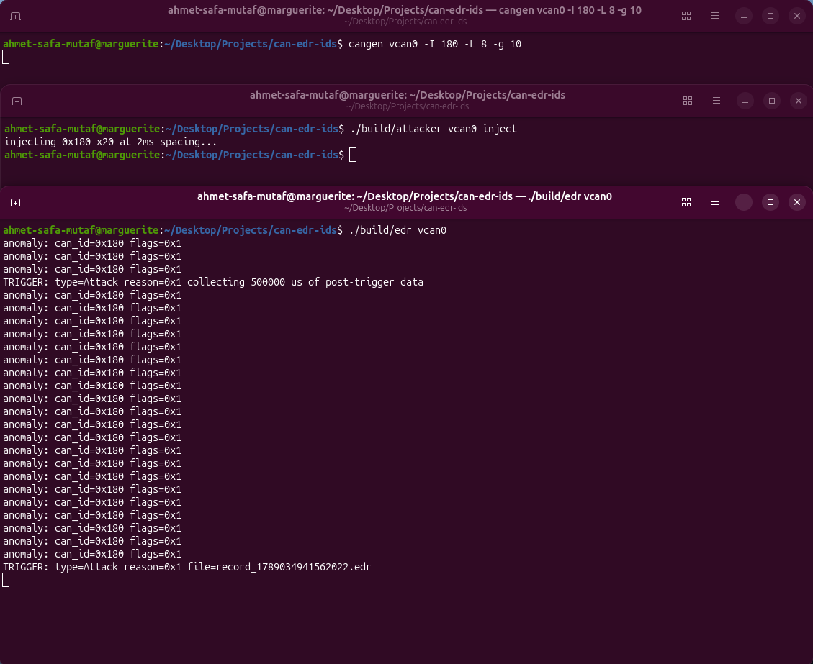
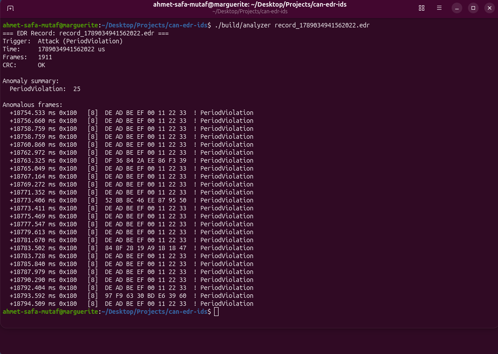

# can-edr-ids

In-vehicle CAN bus event data recorder (black box) with a lightweight
behaviour-based intrusion detection system, built on Linux/SocketCAN.

## Overview

The CAN bus has no authentication. Any node electrically attached to the
bus can transmit any frame with any identifier, and every other node will
accept it. The 2015 remote compromise of a Jeep Cherokee ended with the
attackers doing exactly this — injecting crafted CAN frames to actuate
steering and brakes after pivoting in over the cellular link.

`can-edr-ids` passively captures all CAN traffic, keeps a rolling
pre-trigger window in a fixed-size buffer, checks each frame against a set
of behavioural rules in real time, and — when a crash or an attack is
detected — freezes a tamper-evident record covering the traffic before
and after the event. It is an automotive event data recorder (EDR)
combined with an intrusion detection system (IDS).



*EDR detecting a frame-injection attack in real time (top: normal
traffic, middle: attacker, bottom: EDR capture and trigger).*

## Architecture

```
  traffic / attacker
         |
         v
      vcan0                     (SocketCAN interface)
         |
         v
   +-----------+
   |  capture  |               main loop (edr)
   +-----------+
         |
         v
   +---------------------+
   |  ring buffer + IDS  |      rolling pre-trigger window,
   +---------------------+      per-frame anomaly checks
         |
         v  (trigger: crash or attack)
   +-----------+
   |  recorder |               freeze pre + collect post
   +-----------+
         |
         v
      record_<t>.edr           binary record + CRC-32
         |
         v
   +-----------+
   |  analyzer |               decode, verify, report
   +-----------+
```

| Module                 | Responsibility                                                          |
|------------------------|-----------------------------------------------------------------------|
| `record`               | Core POD types: `RecordEntry`, `FileHeader`, `TriggerType`, `AnomalyFlag` |
| `ring_buffer`          | Fixed-size circular buffer with overwrite semantics (keeps the last N) |
| `can_source`           | `ICanSource` interface plus an in-memory `MockCanSource` for tests   |
| `socket_can_source`    | Linux SocketCAN reader: `recvmsg` + `SO_TIMESTAMP`, bounded read timeout |
| `crc32`                | Table-driven CRC-32 (IEEE 802.3 / zlib), one-shot and incremental    |
| `recorder`             | Serialize a buffer (or frozen pre + post) to an `.edr` file with a trailing CRC |
| `ids`                  | Behaviour-based detection: period, missing-message, unknown-ID, DLC checks |
| `main` (`edr`)         | Capture loop: source -> IDS -> ring buffer -> trigger logic -> recorder |
| `attacker`             | Standalone frame generator: injection, flood, unknown-ID, bad-DLC, crash |
| `analyzer`             | Standalone `.edr` decoder: CRC verification and human-readable report |

## File format

```
  +----------------+---------------------------+----------+
  |   FileHeader   |   RecordEntry  x  N       |  CRC32   |
  |   (20 bytes)   |   (22 bytes each)         | (4 bytes)|
  +----------------+---------------------------+----------+
```

All structures are `#pragma pack(1)` — no padding, fixed on-disk size.

`FileHeader`:

| Field             | Type       | Notes                                            |
|-------------------|------------|--------------------------------------------------|
| `magic`           | `uint32_t` | `0x45445200` — "EDR\0"                            |
| `version`         | `uint16_t` | format version, currently 1                       |
| `entry_size`      | `uint16_t` | `sizeof(RecordEntry)`, for forward compatibility  |
| `trigger_time_us` | `uint64_t` | trigger timestamp, microseconds                   |
| `trigger_type`    | `uint8_t`  | `TriggerType` — 0 = Crash, 1 = Attack             |
| `trigger_reason`  | `uint8_t`  | `AnomalyFlag` that fired (0 for a crash)          |
| `entry_count`     | `uint16_t` | number of `RecordEntry` records that follow       |

`RecordEntry`:

| Field          | Type         | Notes                                     |
|----------------|--------------|-------------------------------------------|
| `timestamp_us` | `uint64_t`   | kernel timestamp, microseconds            |
| `can_id`       | `uint32_t`   | raw CAN ID, flag bits included            |
| `dlc`          | `uint8_t`    | data length, 0–8                          |
| `data`         | `uint8_t[8]` | payload; only the first `dlc` bytes valid |
| `flags`        | `uint8_t`    | `AnomalyFlag` bit field (0 = clean)       |

The trailing CRC-32 (IEEE 802.3, polynomial `0xEDB88320`, init and final
XOR `0xFFFFFFFF`) covers the `FileHeader` and every `RecordEntry`, in
order. It does not cover itself.

## Design constraints

- **No dynamic allocation.** No `new`, no `malloc`, no heap-backed
  containers on the hot path. Every buffer is a fixed-size static
  allocation sized at compile time.
- **No exceptions.** Construction that can fail (opening a socket)
  reports failure through an `is_open()`-style query, not a throw.
- **Deterministic, bounded memory.** Memory use does not grow with
  traffic volume or attack intensity. The discipline is embedded /
  MISRA-style even though the code currently runs in Linux user space.
- **Kernel timestamps.** Frames are timestamped by the kernel via
  `SO_TIMESTAMP` and read with `recvmsg`, so timing analysis is accurate
  regardless of user-space scheduling jitter.
- **Bounded read timeout.** The receive socket has `SO_RCVTIMEO` set, so
  a completely silent bus (a suppression / bus-off attack) does not block
  the loop — the missing-message check still runs on every iteration.

## Intrusion detection (Phase A)

| Attack                      | How it is detected                                    |
|-----------------------------|------------------------------------------------------|
| Frame injection             | Period violation — a periodic frame arrives far earlier than its expected cycle time |
| Suppression / bus-off       | An expected periodic message stops arriving before its deadline |
| Unauthorized node           | A CAN ID that is not in any known message profile     |
| Malformed frame             | Data length code (DLC) different from the profile     |

Phase A is purely behaviour-based: it reasons about **timing** and
**identity** only. It does not decode or interpret payloads, so it needs
no DBC signal definitions and no per-vehicle calibration beyond the list
of expected IDs, their periods, and their lengths.

Each frame is tagged with an `AnomalyFlag` bit field; several rules can
fire on the same frame. A sliding window counts anomalies over a short
interval, and crossing a threshold within that window raises an Attack
trigger. (The shipped defaults — window and threshold — are deliberately
low for demonstration; tune them in `src/main.cpp`.)

### Frozen pre-trigger snapshot

A naive single-buffer recorder loses the very evidence it exists to
capture. With one ring buffer, the post-trigger frames are pushed into
the same buffer that holds the pre-trigger history; under a high-rate
attack the onset frames — the ones that caused the trigger — are
overwritten before the buffer is ever written to disk. The heavier the
attack, the less useful the record.

```
  single buffer, capacity 8, heavy attack after trigger:

  before flush:  [ a7 a8 A1 A2 A3 A4 A5 A6 ]   <- pre-trigger a1..a6 gone
                              ^ trigger onset already overwritten
```

This build freezes the pre-trigger window into a separate fixed buffer at
trigger time, and collects post-trigger frames in another fixed buffer.
The record is the concatenation of the two:

```
  at trigger:    frozen  = copy of the pre-trigger ring  (immutable)
                 post    = empty, fixed capacity

  during post:   new frames -> live ring  AND  -> post buffer

  on flush:      [ FileHeader ][ frozen entries ][ post entries ][ CRC ]
```

The attack onset can never be overwritten by later traffic.

## Analyzer

`analyzer` is a separate program that reads an `.edr` file back. It
checks the magic and version, recomputes the CRC over the header and
entries and compares it to the stored value, then prints the trigger
information and an anomaly summary. With `--full` it also prints the
complete frame timeline, with anomalous frames marked.

If the CRC does not match, the analyzer still prints the full report but
flags the data as unreliable.



*analyzer decoding a recorded attack (CRC verified, anomaly summary).*

## Limitations and future work

- **CRC is integrity, not authentication.** The trailing CRC-32 detects
  accidental corruption — a truncated file, a flipped bit — but anyone
  who edits the record can recompute it. Forensic integrity requires an
  HMAC with a device-held key, or a digital signature. Planned.
- **Phase A cannot detect a masquerade attack.** If an attacker silences
  a legitimate ECU and then impersonates it perfectly — correct ID,
  correct period, correct length — nothing in the timing or identity
  model distinguishes the imposter. Detecting this needs cryptographic
  message authentication (e.g. AUTOSAR SecOC) or physical-layer
  fingerprinting (transceiver clock-skew / voltage signatures).
- **Phase B — content-based detection.** Per-signal range and rate
  limits derived from a DBC (rejecting, for example, a reported vehicle
  speed that is physically impossible or that jumps faster than the
  vehicle can accelerate). The IDS rule structure and the spare
  `AnomalyFlag` bit (`RangeViolation`) were designed with this in mind;
  it is the natural next step.
- **Bare-metal firmware port.** Moving the detection and recording logic
  onto a real microcontroller (STM32), testable in emulation under
  Renode, so the same code runs on an actual ECU rather than a Linux
  host.

## Build

Prerequisites: CMake >= 3.15, a C++17 compiler, and Linux with SocketCAN
headers.

```
cmake -B build
cmake --build build
```

This produces `build/edr`, `build/attacker`, `build/analyzer`, and the
`build/tests/edr_tests` test binary. Catch2 is fetched automatically at
configure time for the tests.

## Run

Set up a virtual CAN interface (no hardware required):

```
sudo modprobe vcan
sudo ip link add dev vcan0 type vcan
sudo ip link set up vcan0
```

Start the recorder:

```
./build/edr vcan0
```

Optionally generate a normal periodic baseline (from `can-utils`):

```
cangen vcan0 -I 180 -L 8 -g 10
```

Launch an attack from another terminal:

```
./build/attacker vcan0 inject
```

| Mode      | Effect                                                                     |
|-----------|---------------------------------------------------------------------------|
| `inject`  | Sends ID `0x180` with the correct DLC every 2 ms — far under its cycle time; raises a period violation |
| `flood`   | Sends frames as fast as possible with no delay — bus saturation / DoS      |
| `unknown` | Sends ID `0x999`, which is in no profile — raises an unknown-ID anomaly    |
| `baddlc`  | Sends known ID `0x180` with a 3-byte payload — raises an invalid-DLC anomaly |
| `crash`   | Sends the crash-trigger ID `0x000` once — the EDR writes a record immediately |

Each attacker mode takes an optional trailing count.

Analyze a resulting record:

```
./build/analyzer record_*.edr          # summary
./build/analyzer record_*.edr --full   # full timeline
```

## Testing

24 unit tests (Catch2) cover `crc32` (known vectors, incremental vs.
one-shot), `ring_buffer` (overwrite, wrap, edge capacities), `ids` (every
Phase A rule and the missing-message state machine), and `recorder`
(round-trip, field integrity, CRC detection of a flipped byte).

```
ctest --test-dir build --output-on-failure
```

## License

MIT
